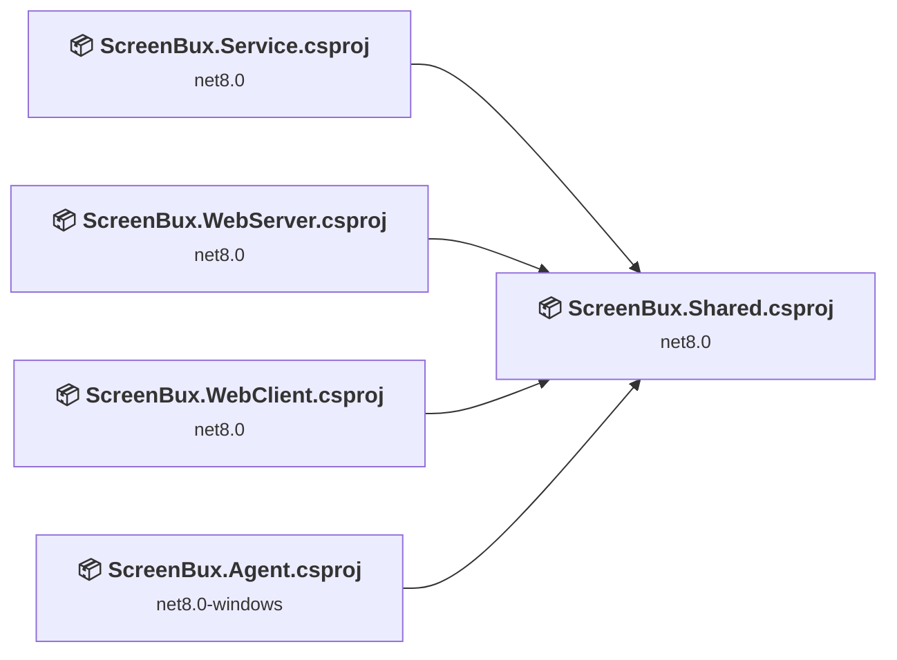
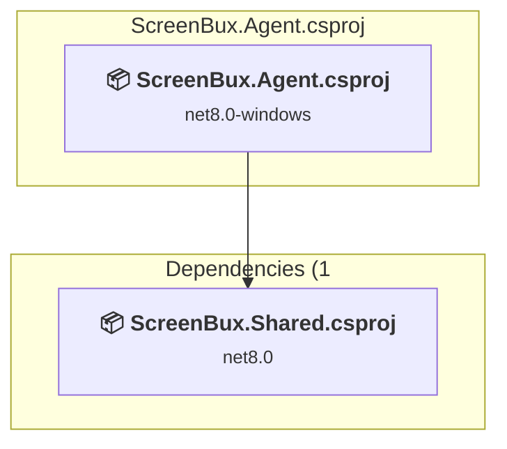
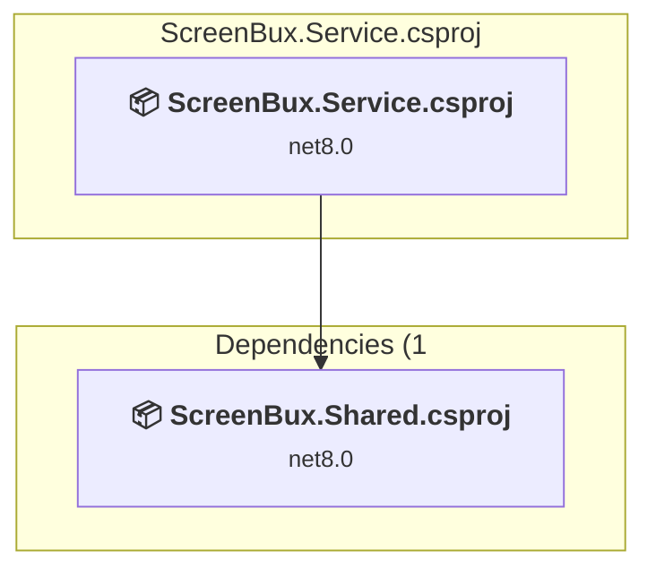
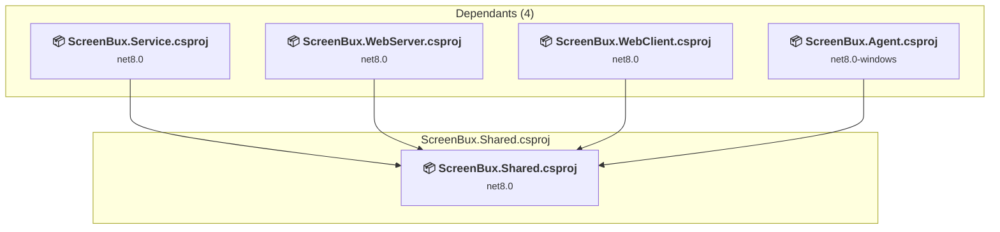
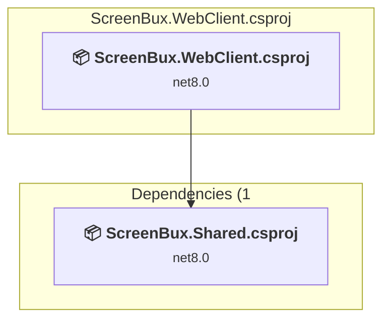
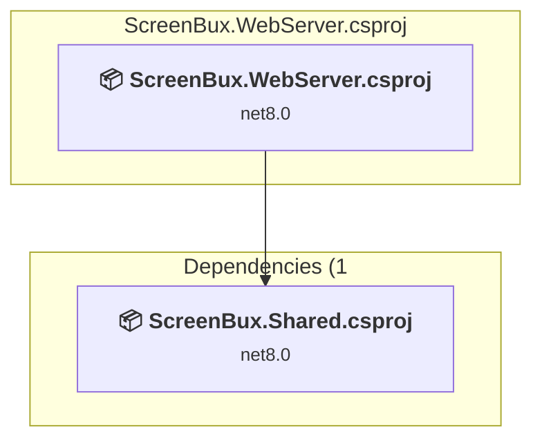

# Projects and dependencies analysis

This document provides a comprehensive overview of the projects and their dependencies in the context of upgrading to .NETCoreApp,Version=v10.0.

## Table of Contents

- [Executive Summary](#executive-Summary)
  - [Highlevel Metrics](#highlevel-metrics)
  - [Projects Compatibility](#projects-compatibility)
  - [Package Compatibility](#package-compatibility)
  - [API Compatibility](#api-compatibility)
  - [Binding Redirect Configuration](#binding-redirect-configuration)
- [Aggregate NuGet packages details](#aggregate-nuget-packages-details)
- [Top API Migration Challenges](#top-api-migration-challenges)
  - [Technologies and Features](#technologies-and-features)
  - [Most Frequent API Issues](#most-frequent-api-issues)
- [Projects Relationship Graph](#projects-relationship-graph)
- [Project Details](#project-details)

  - [src\ScreenBux.Agent\ScreenBux.Agent.csproj](#srcscreenbuxagentscreenbuxagentcsproj)
  - [src\ScreenBux.Service\ScreenBux.Service.csproj](#srcscreenbuxservicescreenbuxservicecsproj)
  - [src\ScreenBux.Shared\ScreenBux.Shared.csproj](#srcscreenbuxsharedscreenbuxsharedcsproj)
  - [src\ScreenBux.WebClient\ScreenBux.WebClient.csproj](#srcscreenbuxwebclientscreenbuxwebclientcsproj)
  - [src\ScreenBux.WebServer\ScreenBux.WebServer.csproj](#srcscreenbuxwebserverscreenbuxwebservercsproj)

## Executive Summary

### Highlevel Metrics

| Metric | Count | Status |
| :--- | :---: | :--- |
| Total Projects | 5 | All require upgrade |
| Total NuGet Packages | 5 | 4 need upgrade |
| Total Code Files | 27 |  |
| Total Code Files with Incidents | 17 |  |
| Total Lines of Code | 1937 |  |
| Total Number of Issues | 144 |  |
| Estimated LOC to modify | 134+ | at least 6,9% of codebase |

### Projects Compatibility

| Project | Target Framework | Difficulty | Package Issues | API Issues | Binding Issues | Est. LOC Impact | Description |
| :--- | :---: | :---: | :---: | :---: | :---: | :---: | :--- |
| [src\ScreenBux.Agent\ScreenBux.Agent.csproj](#srcscreenbuxagentscreenbuxagentcsproj) | net8.0-windows | 🟡 Medium | 0 | 121 | 0 | 121+ | Wpf, Sdk Style = True |
| [src\ScreenBux.Service\ScreenBux.Service.csproj](#srcscreenbuxservicescreenbuxservicecsproj) | net8.0 | 🟢 Low | 3 | 8 | 0 | 8+ | DotNetCoreApp, Sdk Style = True |
| [src\ScreenBux.Shared\ScreenBux.Shared.csproj](#srcscreenbuxsharedscreenbuxsharedcsproj) | net8.0 | 🟢 Low | 0 | 0 | 0 |  | ClassLibrary, Sdk Style = True |
| [src\ScreenBux.WebClient\ScreenBux.WebClient.csproj](#srcscreenbuxwebclientscreenbuxwebclientcsproj) | net8.0 | 🟢 Low | 1 | 5 | 0 | 5+ | AspNetCore, Sdk Style = True |
| [src\ScreenBux.WebServer\ScreenBux.WebServer.csproj](#srcscreenbuxwebserverscreenbuxwebservercsproj) | net8.0 | 🟢 Low | 1 | 0 | 0 |  | AspNetCore, Sdk Style = True |

### Package Compatibility

| Status | Count | Percentage |
| :--- | :---: | :---: |
| ✅ Compatible | 1 | 20,0% |
| ⚠️ Incompatible | 0 | 0,0% |
| 🔄 Upgrade Recommended | 4 | 80,0% |
| ***Total NuGet Packages*** | ***5*** | ***100%*** |

### API Compatibility

| Category | Count | Impact |
| :--- | :---: | :--- |
| 🔴 Binary Incompatible | 112 | High - Require code changes |
| 🟡 Source Incompatible | 10 | Medium - Needs re-compilation and potential conflicting API error fixing |
| 🔵 Behavioral change | 12 | Low - Behavioral changes that may require testing at runtime |
| ✅ Compatible | 2666 |  |
| ***Total APIs Analyzed*** | ***2800*** |  |

## Aggregate NuGet packages details

| Package | Current Version | Suggested Version | Projects | Description |
| :--- | :---: | :---: | :--- | :--- |
| Microsoft.AspNetCore.OpenApi | 8.0.22 | 10.0.9 | [ScreenBux.WebServer.csproj](#srcscreenbuxwebserverscreenbuxwebservercsproj) | NuGet package upgrade is recommended |
| Microsoft.AspNetCore.SignalR.Client | 8.0.1 | 10.0.9 | [ScreenBux.Service.csproj](#srcscreenbuxservicescreenbuxservicecsproj) [ScreenBux.WebClient.csproj](#srcscreenbuxwebclientscreenbuxwebclientcsproj) | NuGet package upgrade is recommended |
| Microsoft.Extensions.Hosting | 8.0.1 | 10.0.9 | [ScreenBux.Service.csproj](#srcscreenbuxservicescreenbuxservicecsproj) | NuGet package upgrade is recommended |
| Microsoft.Extensions.Hosting.WindowsServices | 8.0.1 | 10.0.9 | [ScreenBux.Service.csproj](#srcscreenbuxservicescreenbuxservicecsproj) | NuGet package upgrade is recommended |
| Swashbuckle.AspNetCore | 6.6.2 |  | [ScreenBux.WebServer.csproj](#srcscreenbuxwebserverscreenbuxwebservercsproj) | ✅Compatible |

## Top API Migration Challenges

### Technologies and Features

| Technology | Issues | Percentage | Migration Path |
| :--- | :---: | :---: | :--- |
| WPF (Windows Presentation Foundation) | 82 | 61,2% | WPF APIs for building Windows desktop applications with XAML-based UI that are available in .NET on Windows. WPF provides rich desktop UI capabilities with data binding and styling. Enable Windows Desktop support: Option 1 (Recommended): Target net9.0-windows; Option 2: Add <UseWindowsDesktop>true</UseWindowsDesktop>. |

### Most Frequent API Issues

| API | Count | Percentage | Category |
| :--- | :---: | :---: | :--- |
| T:System.Windows.Threading.DispatcherTimer | 18 | 13,4% | Binary Incompatible |
| T:System.Windows.Controls.Button | 12 | 9,0% | Binary Incompatible |
| M:System.TimeSpan.FromSeconds(System.Double) | 9 | 6,7% | Source Incompatible |
| T:System.Windows.Controls.TextBlock | 9 | 6,7% | Binary Incompatible |
| T:System.Windows.RoutedEventHandler | 8 | 6,0% | Binary Incompatible |
| P:System.Windows.UIElement.IsEnabled | 6 | 4,5% | Binary Incompatible |
| T:System.Uri | 5 | 3,7% | Behavioral Change |
| E:System.Windows.Threading.DispatcherTimer.Tick | 4 | 3,0% | Binary Incompatible |
| P:System.Windows.Threading.DispatcherTimer.Interval | 4 | 3,0% | Binary Incompatible |
| M:System.Windows.Threading.DispatcherTimer.#ctor | 4 | 3,0% | Binary Incompatible |
| T:System.Windows.Controls.TextBox | 4 | 3,0% | Binary Incompatible |
| P:System.Windows.Controls.TextBlock.Text | 4 | 3,0% | Binary Incompatible |
| T:System.Windows.RoutedEventArgs | 3 | 2,2% | Binary Incompatible |
| M:System.Windows.Threading.DispatcherTimer.Stop | 2 | 1,5% | Binary Incompatible |
| M:System.Windows.Threading.DispatcherTimer.Start | 2 | 1,5% | Binary Incompatible |
| M:System.Uri.#ctor(System.String,System.UriKind) | 2 | 1,5% | Behavioral Change |
| T:System.Windows.Application | 2 | 1,5% | Binary Incompatible |
| E:System.Windows.Controls.Primitives.ButtonBase.Click | 2 | 1,5% | Binary Incompatible |
| T:System.Windows.Threading.Dispatcher | 2 | 1,5% | Binary Incompatible |
| P:System.Windows.Threading.DispatcherObject.Dispatcher | 2 | 1,5% | Binary Incompatible |
| M:System.Windows.Threading.Dispatcher.Invoke(System.Action) | 2 | 1,5% | Binary Incompatible |
| T:System.Windows.Media.Brushes | 2 | 1,5% | Binary Incompatible |
| T:System.Windows.Media.SolidColorBrush | 2 | 1,5% | Binary Incompatible |
| E:System.Windows.Window.Closed | 2 | 1,5% | Binary Incompatible |
| E:System.Windows.FrameworkElement.Loaded | 2 | 1,5% | Binary Incompatible |
| M:System.Windows.Window.#ctor | 2 | 1,5% | Binary Incompatible |
| T:System.Text.Json.JsonDocument | 2 | 1,5% | Behavioral Change |
| M:System.Windows.Application.Run | 1 | 0,7% | Binary Incompatible |
| P:System.Windows.Application.StartupUri | 1 | 0,7% | Binary Incompatible |
| M:System.Windows.Application.#ctor | 1 | 0,7% | Binary Incompatible |
| M:System.Windows.Application.LoadComponent(System.Object,System.Uri) | 1 | 0,7% | Binary Incompatible |
| M:System.Windows.Controls.Primitives.TextBoxBase.ScrollToEnd | 1 | 0,7% | Binary Incompatible |
| M:System.Windows.Controls.Primitives.TextBoxBase.AppendText(System.String) | 1 | 0,7% | Binary Incompatible |
| P:System.Windows.Media.Brushes.Red | 1 | 0,7% | Binary Incompatible |
| P:System.Windows.Media.Brushes.Green | 1 | 0,7% | Binary Incompatible |
| T:System.Windows.Media.Brush | 1 | 0,7% | Binary Incompatible |
| P:System.Windows.Controls.TextBlock.Foreground | 1 | 0,7% | Binary Incompatible |
| T:System.Windows.Markup.IComponentConnector | 1 | 0,7% | Binary Incompatible |
| T:System.Windows.Window | 1 | 0,7% | Binary Incompatible |
| M:System.TimeSpan.FromMinutes(System.Double) | 1 | 0,7% | Source Incompatible |
| T:System.Net.Http.HttpContent | 1 | 0,7% | Behavioral Change |
| M:Microsoft.AspNetCore.Builder.ExceptionHandlerExtensions.UseExceptionHandler(Microsoft.AspNetCore.Builder.IApplicationBuilder,System.String,System.Boolean) | 1 | 0,7% | Behavioral Change |
| M:System.Uri.#ctor(System.String) | 1 | 0,7% | Behavioral Change |

## Projects Relationship Graph

Legend:
📦 SDK-style project
⚙️ Classic project

## Project Details

### src\ScreenBux.Agent\ScreenBux.Agent.csproj

#### Project Info

- **Current Target Framework:** net8.0-windows
- **Proposed Target Framework:** net10.0-windows
- **SDK-style**: True
- **Project Kind:** Wpf
- **Dependencies**: 1
- **Dependants**: 0
- **Number of Files**: 6
- **Number of Files with Incidents**: 6
- **Lines of Code**: 453
- **Estimated LOC to modify**: 121+ (at least 26,7% of the project)

#### Dependency Graph

Legend:
📦 SDK-style project
⚙️ Classic project

### API Compatibility

| Category | Count | Impact |
| :--- | :---: | :--- |
| 🔴 Binary Incompatible | 112 | High - Require code changes |
| 🟡 Source Incompatible | 4 | Medium - Needs re-compilation and potential conflicting API error fixing |
| 🔵 Behavioral change | 5 | Low - Behavioral changes that may require testing at runtime |
| ✅ Compatible | 305 |  |
| ***Total APIs Analyzed*** | ***426*** |  |

#### Project Technologies and Features

| Technology | Issues | Percentage | Migration Path |
| :--- | :---: | :---: | :--- |
| WPF (Windows Presentation Foundation) | 82 | 67,8% | WPF APIs for building Windows desktop applications with XAML-based UI that are available in .NET on Windows. WPF provides rich desktop UI capabilities with data binding and styling. Enable Windows Desktop support: Option 1 (Recommended): Target net9.0-windows; Option 2: Add <UseWindowsDesktop>true</UseWindowsDesktop>. |

### src\ScreenBux.Service\ScreenBux.Service.csproj

#### Project Info

- **Current Target Framework:** net8.0
- **Proposed Target Framework:** net10.0
- **SDK-style**: True
- **Project Kind:** DotNetCoreApp
- **Dependencies**: 1
- **Dependants**: 0
- **Number of Files**: 11
- **Number of Files with Incidents**: 6
- **Lines of Code**: 962
- **Estimated LOC to modify**: 8+ (at least 0,8% of the project)

#### Dependency Graph

Legend:
📦 SDK-style project
⚙️ Classic project

### API Compatibility

| Category | Count | Impact |
| :--- | :---: | :--- |
| 🔴 Binary Incompatible | 0 | High - Require code changes |
| 🟡 Source Incompatible | 6 | Medium - Needs re-compilation and potential conflicting API error fixing |
| 🔵 Behavioral change | 2 | Low - Behavioral changes that may require testing at runtime |
| ✅ Compatible | 897 |  |
| ***Total APIs Analyzed*** | ***905*** |  |

### src\ScreenBux.Shared\ScreenBux.Shared.csproj

#### Project Info

- **Current Target Framework:** net8.0
- **Proposed Target Framework:** net10.0
- **SDK-style**: True
- **Project Kind:** ClassLibrary
- **Dependencies**: 0
- **Dependants**: 4
- **Number of Files**: 7
- **Number of Files with Incidents**: 1
- **Lines of Code**: 155
- **Estimated LOC to modify**: 0+ (at least 0,0% of the project)

#### Dependency Graph

Legend:
📦 SDK-style project
⚙️ Classic project

### API Compatibility

| Category | Count | Impact |
| :--- | :---: | :--- |
| 🔴 Binary Incompatible | 0 | High - Require code changes |
| 🟡 Source Incompatible | 0 | Medium - Needs re-compilation and potential conflicting API error fixing |
| 🔵 Behavioral change | 0 | Low - Behavioral changes that may require testing at runtime |
| ✅ Compatible | 172 |  |
| ***Total APIs Analyzed*** | ***172*** |  |

### src\ScreenBux.WebClient\ScreenBux.WebClient.csproj

#### Project Info

- **Current Target Framework:** net8.0
- **Proposed Target Framework:** net10.0
- **SDK-style**: True
- **Project Kind:** AspNetCore
- **Dependencies**: 1
- **Dependants**: 0
- **Number of Files**: 18
- **Number of Files with Incidents**: 3
- **Lines of Code**: 159
- **Estimated LOC to modify**: 5+ (at least 3,1% of the project)

#### Dependency Graph

Legend:
📦 SDK-style project
⚙️ Classic project

### API Compatibility

| Category | Count | Impact |
| :--- | :---: | :--- |
| 🔴 Binary Incompatible | 0 | High - Require code changes |
| 🟡 Source Incompatible | 0 | Medium - Needs re-compilation and potential conflicting API error fixing |
| 🔵 Behavioral change | 5 | Low - Behavioral changes that may require testing at runtime |
| ✅ Compatible | 1026 |  |
| ***Total APIs Analyzed*** | ***1031*** |  |

### src\ScreenBux.WebServer\ScreenBux.WebServer.csproj

#### Project Info

- **Current Target Framework:** net8.0
- **Proposed Target Framework:** net10.0
- **SDK-style**: True
- **Project Kind:** AspNetCore
- **Dependencies**: 1
- **Dependants**: 0
- **Number of Files**: 5
- **Number of Files with Incidents**: 1
- **Lines of Code**: 208
- **Estimated LOC to modify**: 0+ (at least 0,0% of the project)

#### Dependency Graph

Legend:
📦 SDK-style project
⚙️ Classic project

### API Compatibility

| Category | Count | Impact |
| :--- | :---: | :--- |
| 🔴 Binary Incompatible | 0 | High - Require code changes |
| 🟡 Source Incompatible | 0 | Medium - Needs re-compilation and potential conflicting API error fixing |
| 🔵 Behavioral change | 0 | Low - Behavioral changes that may require testing at runtime |
| ✅ Compatible | 266 |  |
| ***Total APIs Analyzed*** | ***266*** |  |

